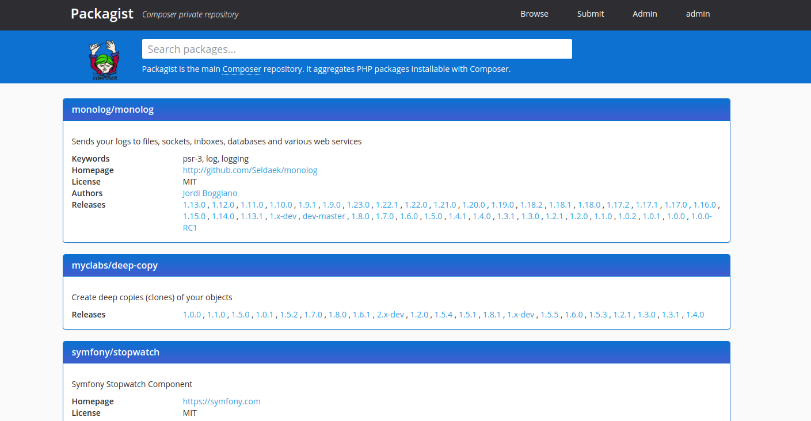

Packeton - Private PHP package repository for vendors
======================================================

Fork of [Packagist](https://github.com/composer/packagist). 
The Open Source alternative of [Private Packagist for vendors](https://packagist.com), that based on [Satis](https://github.com/composer/satis) and [Packagist](https://github.com/composer/packagist).

Features
--------

- Compatible with composer.
- Customers user and groups.
- Limit access by vendor and versions.
- Expire access time for user.
- Mirroring for packages' zip files and downloads its from your host.

What was changed in this fork?
-----------------------------
- Disable anonymously access, registrations, added groups and permissions.
- Support MySQL and PostgresSQL.
- Support Symfony 3.4
- Removed HWIOBundle, NelmioCorsBundle, NelmioSecurityBundle, Algolia, GoogleAnalytics dependencies.

Demo
-------
See our [Administration Demo](https://pkg.okvpn.org). Username/password (admin/composer)

[](docs/demo.png)

Requirements
------------

- MySQL or PostgresSQL for the main data store.
- Redis for some functionality (favorites, download statistics).
- git/svn/hg depending on which repositories you want to support.

Installation
------------

1. Clone the repository
2. Copy and edit `app/config/parameters.yml` and change the relevant values for your setup.
3. Install dependencies: `composer install`
4. Run `bin/console doctrine:schema:create` to setup the DB
5. Run `bin/console assets:install web` to deploy the assets on the web dir.
6. Run `bin/console cache:warmup --env=prod` and `app/console cache:warmup --env=prod` to warmup cache
7. Create admin user via console.

```
php bin/console fos:user:create
# Add admin role
php bin/console fos:user:promote <username> ROLE_ADMIN
```

8. Enable cron tabs and background jobs.
Enable crontab `crontab -e -u www-data` 

```
*/30 * * * * /var/www/packagist/bin/console --env=prod packagist:update >> /dev/null
0 0 * * * /var/www/packagist/bin/console --env=prod packagist:stats:compile >> /dev/null
```

Setup Supervisor to run worker.

```
sudo apt -y --no-install-recommends install supervisor
```

Create a new supervisor configuration.

```
sudo vim /etc/supervisor/conf.d/packagist.conf
```
Add the following lines to the file.

```
[program:packagist-workers]
environment =
        HOME=/var/www/
command=/var/www/packagist/bin/console packagist:run-workers --env=prod --no-debug
directory=/var/www/packagist/
process_name=%(program_name)s_%(process_num)02d
numprocs=1
autostart=true
autorestart=true
startsecs=0
redirect_stderr=true
priority=1
user=www-data
```

9. **IMPORTANT** Make sure that web-server, cron and supervisor run under the same user, that should have an ssh key 
that gives it read (clone) access to your git/svn/hg repositories. If you run application under `www-data` 
you can add your ssh keys to /var/www/.ssh/

You should now be able to access the site, create a user, etc.

10. Make a VirtualHost with DocumentRoot pointing to web/

Ssh key access and composer oauth token.
-----------------------
Packagist uses the Composer global config and global ssh-key to get read access to your repositories, so
the supervisor worker `packagist:run-workers` and web-server must run under the user, 
that have ssh key or composer config that gives it read (clone) access to your git/svn/hg repositories.
For example, if your application runs under `www-data` and have home directory `/var/www`, directory
structure must be like this.

```
    └── /var/www/
        ├── .ssh/ # ssh keys directory
        │   ├── config
        │   ├── id_rsa # main ssh key
        │   ├── private_key_2 # additional ssh key
        │   └── private_key_3
        │
        └── .composer/ # composer home
            ├── auth.json
            └── config.json
    
```

Example ssh config for multiple SSH Keys for different github account/repos, 
see [here for details](https://gist.github.com/jexchan/2351996)

```
# .ssh/config - example

Host github-oroinc
	HostName github.com
	User git
	IdentityFile /var/www/.ssh/private_key_2
	IdentitiesOnly yes

Host github-org2
	HostName github.com
	User git
	IdentityFile /var/www/.ssh/private_key_3
	IdentitiesOnly yes

```

You can add GitHub/GitLab access token to `auth.json`, see [here](https://gist.github.com/jeffersonmartin/d0d4a8dfec90d224d14f250b36c74d2f)

```
{
    "github-oauth": {
        "github.com": "xxxxxxxxxxxxx"
    }
}
```

#### Don't use GitHub Api.

By default composer will use GitHub API to get metadata for your GitHub repository, you can add 
`use-github-api` to composer config.json to always use ssh key and clone the repository as 
it would with any other git repository, [see here](https://getcomposer.org/doc/06-config.md#use-github-api)


Installation using docker
------------------------
You can use the docker [image okvpn/packeton](https://hub.docker.com/r/okvpn/packeton).

#### Environment variables

* `PRIVATE_REPO_DOMAIN_LIST` - Save ssh fingerprints to known_hosts for this domain.

* `VIRTUAL_HOST` - Packagist site domain (example packagist.youcomany.org). 
Used for downloading the mirroring zip packages. (The host add into dist url for composer metadata).

* `DATABASE_DRIVER` - Specify database driver (pdo_mysql, pdo_pgsql)

* `DATABASE_HOST` -  Specify hostname of the database

* `DATABASE_PORT` - Specify port of the database (optional)

* `DATABASE_USER` - Specify user to use to authenticate to the database 

* `DATABASE_NAME` - Specify database name

* `DATABASE_PASSWORD` - Specify database password

* `ADMIN_USER` - Creating admin account, by default there is no admin user created so 
you won't be able to login to the packagist. To create an admin account you need to use 
environment variables to pass in an initial username and password (ADMIN_PASSWORD, ADMIN_EMAIL)

* `ADMIN_PASSWORD` - used together with `ADMIN_USER`

* `ADMIN_EMAIL` - used together with `ADMIN_USER`

The typical example `docker-compose.yml`

```yaml
version: '2'

services:
    postgres:
        hostname: postgres
        container_name: postgres_packagist
        image: postgres:9.6
        volumes:
            - .docker/db:/var/lib/postgresql/data
        environment:
            POSTGRES_DB: packagist
            POSTGRES_PASSWORD: 123456
        expose:
            - "5432"
    packagist:
        image: okvpn/packeton:latest
        container_name: packagist
        hostname: packagist
        volumes:
            - .docker/zipball:/var/www/packagist/app/zipball # cache for zipped directors
            - .docker/composer:/var/www/.composer # to place composer config
            - .docker/ssh:/var/www/.ssh           # to place priv ssh key

            # example how to overwrite main layout to change logo 
            # - ${PWD}/PackagistWebBundle:/var/www/packagist/app/Resources/PackagistWebBundle
        links:
            - "postgres"
        environment:
            PRIVATE_REPO_DOMAIN_LIST: bitbucket.org gitlab.com github.com
            VIRTUAL_HOST: pkg.okvpn.org
            DATABASE_HOST: postgres
            DATABASE_PORT: 5432
            DATABASE_DRIVER: pdo_pgsql
            DATABASE_USER: postgres
            DATABASE_NAME: packagist
            DATABASE_PASSWORD: 123456
            ADMIN_USER: admin
            ADMIN_PASSWORD: composer
            ADMIN_EMAIL: admin@example.com
        ports:
          - 127.0.0.1:8088:80

```

Also see [packagist-docker](https://github.com/vtsykun/packagist-docker.git).

Usage and Authentication
------------------------
By default admin user have access to all repositories and able to submit packages, create users, view statistics. 
The customer users can only see related packages and own profile with instruction how to use api token.

To authenticate composer access to repository needs add credentials globally into auth.json, for example:

```
composer config --global --auth http-basic.pkg.okvpn.org admin Ydmhi1C3XIP5fnRWc3y2
```

API Token you can found in your Profile.

LICENSE
------
MIT
